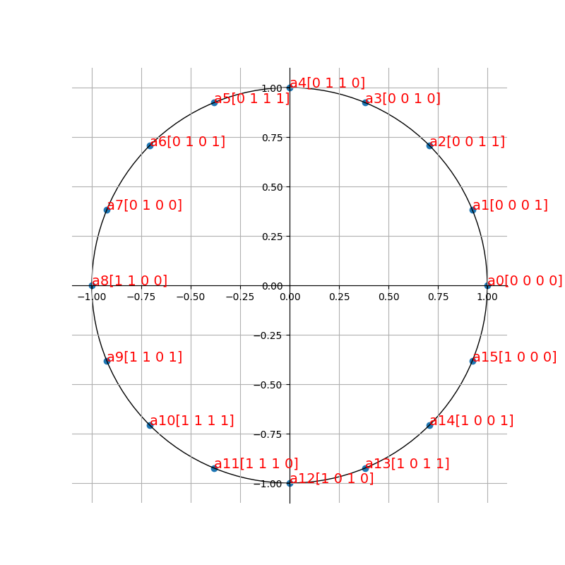
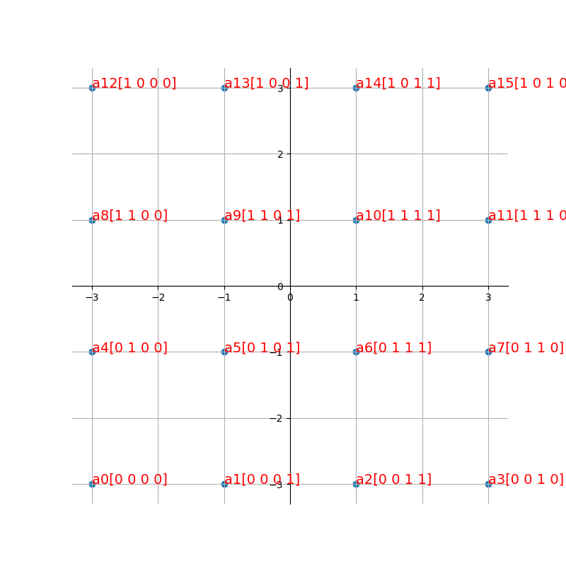
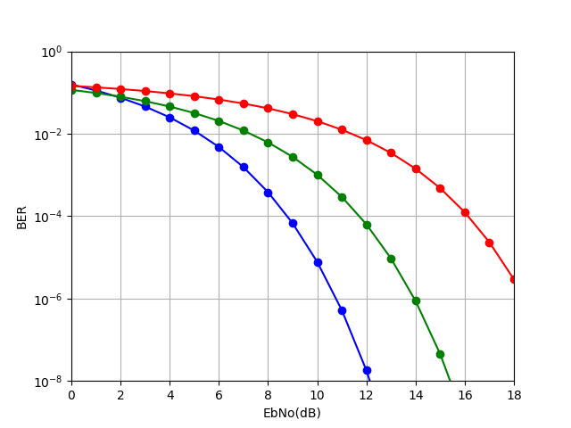
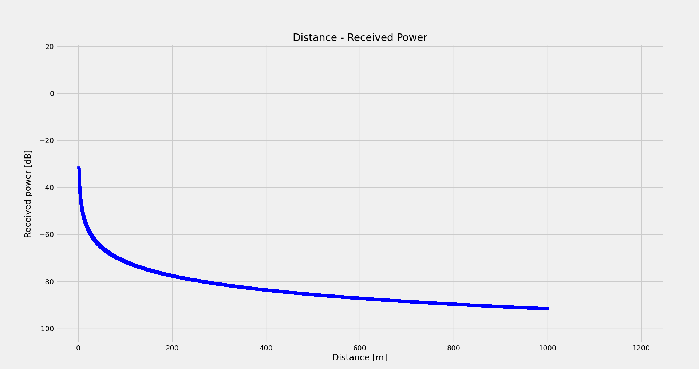
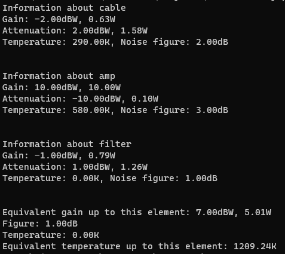
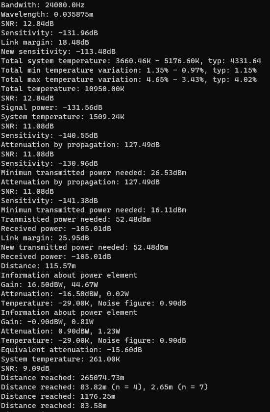
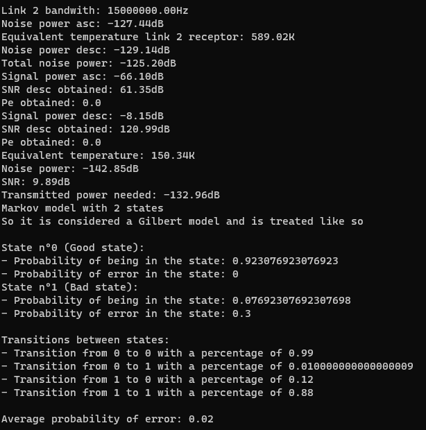
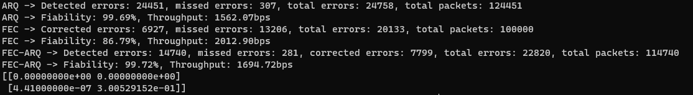
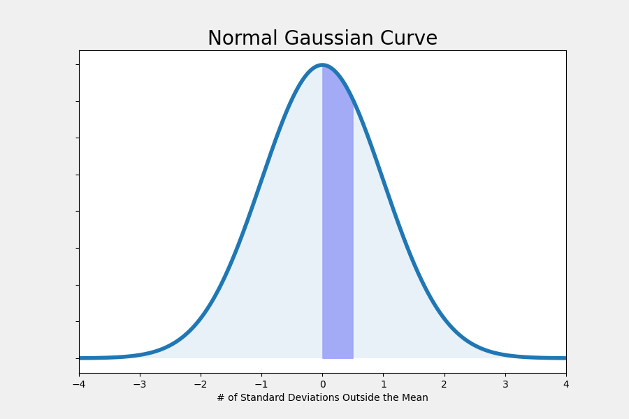

<!-- PROJECT LOGO -->
<br />
<p align="center">
  <a href="https://github.com/pasblo/ComsChannelsSim">
    
  </a>

  <h3 align="center">project_title</h3>

  <p align="center">
    project_description
    <br />
    <a href="https://github.com/pasblo/ComsChannelsSim"><strong>Explore the docs »</strong></a>
    <br />
    <br />
    <a href="https://github.com/pasblo/ComsChannelsSim">View Demo</a>
    ·
    <a href="https://github.com/pasblo/ComsChannelsSim/issues">Report Bug</a>
    ·
    <a href="https://github.com/pasblo/ComsChannelsSim/issues">Request Feature</a>
  </p>
</p>


<!-- TABLE OF CONTENTS -->
<details open="open">
  <summary><h2 style="display: inline-block">Table of Contents</h2></summary>
  <ol>
    <li>
      <a href="#about-the-project">About The Project</a>
      <ul>
        <li><a href="#built-with">Built With</a></li>
      </ul>
    </li>
    <li>
      <a href="#getting-started">Getting Started</a>
      <ul>
        <li><a href="#prerequisites">Prerequisites</a></li>
        <li><a href="#installation">Installation</a></li>
      </ul>
    </li>
    <li><a href="#usage">Usage</a></li>
    <li><a href="#roadmap">Roadmap</a></li>
    <li><a href="#contributing">Contributing</a></li>
    <li><a href="#license">License</a></li>
    <li><a href="#contact">Contact</a></li>
    <li><a href="#acknowledgements">Acknowledgements</a></li>
  </ol>
</details>


<!-- ABOUT THE PROJECT -->
## About The Project

This project allows the simulation of different channel elements:
* Channel element: Allows simulating how different attenuations affect the power, probabilities of error, and simulate bit by bit error.
* Modulation element: Allows simulating a modulator or demodulator, supports several modulation techniques, such as X-PSK, X-FSK, QAM and PAM. It can be used to calculate different types of error rates, graph SNR curves and calculating bandwiths.
* Power element: Allows the connection of several elements in cascade to calculate their overall effect on a received signal.

All elements support working in natural units or in logarithmic units, and can be chained toguether to sumilate more complex systems.
The repository does also allow the calculation of some values in the system and the optimization of others.

The project contains some examples using all created functions as reference, and most of the functions in the library are documented on how to use them:
* LibraryTester: A program that allows to test the different fucntions and classes to get used to them. Uncomment the part you want to test.
* SamplesSolutions: A program that shows how to use this library in the real world, uses the problems samples proposed and solves them using this library.

Some samples of different sample codes working:

* A 16-PSK modulation plot
<p align="center">
  
</p>

* A 16-QAM modulation plot
<p align="center">
  
</p>

* A EbNo vs BER plot for different modulations
<p align="center">
  
</p>

* A Distance to Received Power graph
<p align="center">
  
</p>

* An example of power element concatenated
<p align="center">
  
</p>

* A complex example of power element concatenated
<p align="center">
  
</p>

* A markov model of two states
<p align="center">
  
</p>

* Information from different transmission algorithms
<p align="center">
  
</p>

* Plotting of a gaussian function (The library does also include a function for it)
<p align="center">
  
</p>

### Built With

* [numpy](https://github.com/numpy/numpy)
* [itertools](https://github.com/iter-tools/iter-tools)
* random
* [scipy](https://github.com/scipy/scipy)
* math
* [komm](https://github.com/rwnobrega/komm)
* cmath
* [matplotlib](https://github.com/matplotlib/matplotlib)
* time


<!-- GETTING STARTED -->
## Getting Started

To get a local copy up and running follow these simple steps.

### Prerequisites

The project uses some libraries that need to be installed, you can use the pip installer, go check <a href="https://github.com/pypa/get-pip">this project by pypa</a>, on how to install easily pip.
* scipy
  ```sh
  pip install scipy
  ```
* komm
  ```sh
  pip install komm
  ```
* matplotlib
  ```sh
  pip install matplotlib
  ```

### Installation

1. Clone the repo
   ```sh
   git clone https://github.com/pasblo/ComsChannelsSim.git
   ```


<!-- ROADMAP -->
## Roadmap

See the [open issues](https://github.com/pasblo/ComsChannelsSim/issues) for a list of proposed features (and known issues).


<!-- CONTRIBUTING -->
## Contributing

Contributions are what make the open source community such an amazing place to be learn, inspire, and create. Any contributions you make are **greatly appreciated**.

1. Fork the Project
2. Create your Feature Branch (`git checkout -b feature/AmazingFeature`)
3. Commit your Changes (`git commit -m 'Add some AmazingFeature'`)
4. Push to the Branch (`git push origin feature/AmazingFeature`)
5. Open a Pull Request


<!-- LICENSE -->
## License

Distributed under the MIT License. See `LICENSE` for more information.


<!-- CONTACT -->
## Contact

Pablo Rivero - [@Pasblo39](https://twitter.com/PabloRiveroLaz2) - pabriv23@gmail.com

Project Link: [https://github.com/pasblo/ComsChannelsSim](https://github.com/pasblo/ComsChannelsSim)


<!-- ACKNOWLEDGEMENTS -->
## Acknowledgements

* []()
* []()
* []()